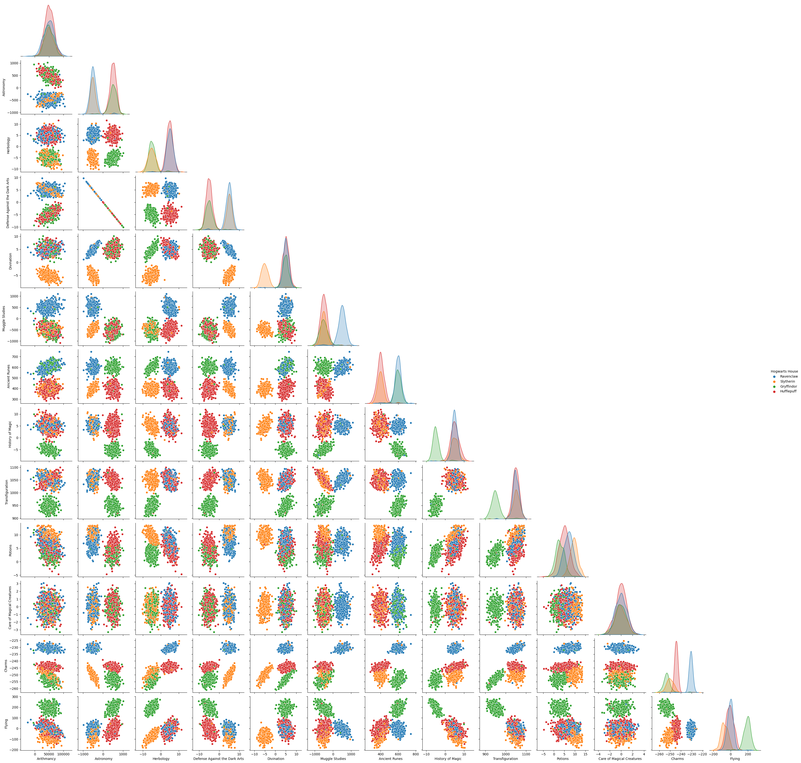

# dslr  : Datascience X Logistic Regression

---

Dslr is a Machine Learning project at 42 school, done by a team of two. This is our solution.

Dslr consists of training a ***multivariate logistic regression model** to solve a classification problem.

---

## Intro

The main objective is to recreate a ✨ magic Sorting Hat 🎓 ✨ to predict Hogwarts student houses. When [Harry Potter's universe](https://www.wizardingworld.com/) meets a Data scientist.

The training dataset consists of 1600 students caracteristics, each 🧙 with his own features :

- Four Biographic features `First Name` `Last Name` `Birthday` `Best Hand`
- A set of 13 wizard skills being refered as : `Arithmancy` `Astronomy` `Herbology` `Defense Against the Dark Arts` `Divination` `Muggle Studies` `Ancient Runes` `History of Magic` `Transfiguration` `Potions` `Care of Magical Creatures` `Charms` `Flying`.

A model is trained, based on specific selected features, so that it can predict student's affiliation to one of the four 🏰 hogwart's houses
    - 🦅 `Gryffindor`
    - 🦡 `Hufflepuff`
    - 🐦‍⬛ `Ravenclaw`
    - 🐍 `Slytherin`
The targeted accuracy for predicting testing dataset should be above 98%. 

Classification of students features with a Pairplot diagram



---

### Directory Structure

Project directory structure was organized accordingly with the following links guidelines.
[The Hitchhiker's Guide to Python - Structuring Your Project](https://docs.python-guide.org/writing/structure/)
[CookieCutter utility](https://drivendata.github.io/cookiecutter-data-science/#cookiecutter-data-science)
[How To Structure a Data Science Project: A Step-by-Step Guide](https://www.kdnuggets.com/2022/05/structure-data-science-project-stepbystep-guide.html)

### Jupyter

Jupyter notebooks were used for exploration and communication.

## Usage

### virtual environment

A Python [virtual environment](https://docs.python.org/3/library/venv.html) is installed and set up so that this project is self-contained, isolated from the system Python and from other projects virtual environments.
The virtual environment has its own Python Interpreter and dependencies as third-party libraries that are installed from `requirement.txt` file specifications. It avoids system pollution, dependency conflicts and optimizes reproducibility for a data science project. We used `virtualenv` tool for dependency management and project isolation. Instead of using `bash` script, we chose to exploit `Makefile` capabilities and readability for generic management tasks.

`make` to install the *virtual environment* with its *requirements*.

virtual environment `venv` activation:

```shell
source venv/bin/activate
```

Then, ```python ./dslr/logreg_train.py``` to train the dataset.

```python ./dslr/logreg_predict.py``` to predict.

### Describe

`describe.py` mimics *pandas* library `describe()` function.
A data file must be provided as argument.

Describing the training dataset :

```shell
python ./dslr/describe.py datasets/dataset_train.csv
```

Output:

```table
         Index Arithmancy Astronomy  ... Care of Magical Creatures   Charms   Flying
count  1600.00    1566.00   1568.00  ...                   1560.00  1600.00  1600.00
mean    799.50   49634.57     39.80  ...                     -0.05  -243.37    21.96
std     462.02   16679.81    520.30  ...                      0.97     8.78    97.63
min       0.00  -24370.00   -966.74  ...                     -3.31  -261.05  -181.47
25%     399.75   38511.50   -489.55  ...                     -0.67  -250.65   -41.87
50%     799.50   49013.50    260.29  ...                     -0.04  -244.87    -2.51
75%    1199.25   60811.25    524.77  ...                      0.59  -232.55    50.56
max    1599.00  104956.00   1016.21  ...                      3.06  -225.43   279.07
```

#### Tests

Test runner chosen : `unittest` included in Python standard library.

`./dslr/tests/testDescribe.py` compares `DescriberClass` and pandas.describe()

`./dslr/tests/testUtilsMath.py` compares `utils.math.py` functions and numpy / pandas equivalent functions

#### describe.exe

An executable application could be built with
[pyinstaller](https://realpython.com/pyinstaller-python/)

- adding the entry-point script

```shell
pyinstaller ./dslr/describe.py
```

## Project status

The project has to be accomplished by a team of two studs in order to be validated.
Since there is some bug on 42-intra, unfairly blocking me for that project,
I am doing it all by myself while awaiting for 42-staff to unblock me.

### To-do-list

||from Done| status | to do next|
|---|:---:|---|---|
|describe.py | `80%` | functional |+ unit testing(50%), + add bonus|
|plots| `50%` | undone | analysis ok in jupyter notebook >> to .py|
|logreg train |`80%`|  functional | remove comments|
|logreg predict | `90%` |  functional | remove comments|
|model metrics| `20%` | X |choose relevent metrics, start toolkit|
|bonus|`0%`||||

### Results so far

`98.3%` prediction accuracy on the training dataset with a 10-feature based model.
I have to try to increase accuracy with other feature(s).

## Subject

### Mandatory part

#### Describe from scratch

A ```describe.py``` program to describe the dataset, that behaves as ```nympy.describe()```. It is forbidden to use any function that makes the job,
like: count, mean, std, min, max, percentile, etc...

#### Logistic regression training

```multi-classifier using a logistic regression one-vs-all```
logreg_train.[extension] dataset_train.csv

Gradient descent algoritm to minimize the error

Generates a file containing the model weights.

Usage :

```shell
logreg_predict.[extension] dataset_train.csv [weights]
```

#### Prediction

Predict from '.datasets/dataset_test.csv' and generate a prediction file `houses.csv`` formatted exactly as follows:

```shell
$> cat houses.csv
Index,Hogwarts House
0,Gryffindor
1,Hufflepuff
2,Ravenclaw
[...] 
```

### Bonus

• Add more fields for describe.py
• Implement a stochastic gradient descent
• Implement other optimization algorithms (Batch GD/mini-batch GD/ you name

### Peer-Evaluation

Answers will be evaluated using accuracy score of the Scikit-Learn library. Professor
McGonagall agrees that your algorithm is comparable to the Sorting Hat only if it has a
minimum precision of 98% .

## Our solution to Dslr

### venv

Virtual environment is created by a `Makefile`.
In a terminal, ```make``` command, then

```shell
source /venv/bin/activate
```

### Toolkit and testing

## Some helpful links

### Python

[setup.py script (french)](https://docs.python.org/fr/3/distutils/setupscript.html)

### format, width, precision
[Precision](https://www.pylenin.com/blogs/python-width-precision/)

### pandas dataframes and np.arrays

[subsetting data](https://pandas.pydata.org/docs/getting_started/intro_tutorials/03_subset_data.html)
[Numpy hierachy](https://numpy.org/doc/stable/reference/arrays.scalars.html)

### for the describe.py part

[Argument parser = argparse](https://docs.python.org/3/library/argparse.html)
[Exceptions](https://docs.python.org/3/tutorial/errors.html)
[Pandas describe doc](https://pandas.pydata.org/docs/reference/api/pandas.DataFrame.describe.html#)
[numpy statistics](https://numpy.org/doc/stable/reference/routines.statistics.html)
[numpy percentile](https://numpy.org/doc/stable/reference/generated/numpy.percentile.html)
[Math and statistics online calculator](https://www.calculator.net/math-calculator.html)
[skweness and kurtosis](https://inside-machinelearning.com/skewness-et-kurtosis/)

[subset data](https://pandas.pydata.org/docs/getting_started/intro_tutorials/03_subset_data.html)

### for the logistic regression part

[Kaggle : logistic regression from scratch](https://www.kaggle.com/code/jagannathrk/logistic-regression-from-scratch-python)

### Plots

[constrained layout](https://matplotlib.org/stable/tutorials/intermediate/constrainedlayout_guide.html#sphx-glr-tutorials-intermediate-constrainedlayout-guide-py)

### testing

[unittest](https://docs.python.org/fr/3/library/unittest.html)
[unittest (in french)](https://gayerie.dev/docs/python/python3/unittest.html)
[unittest tutorial - openclassrooms](https://openclassrooms.com/fr/courses/7155841-testez-votre-projet-python/7414161-ajoutez-des-tests-avec-unittest)
